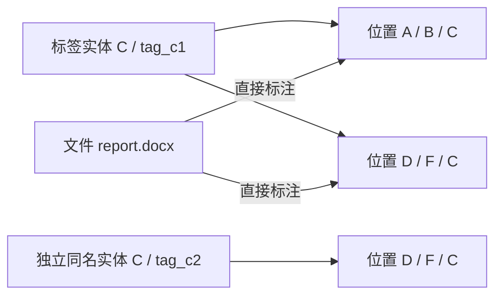
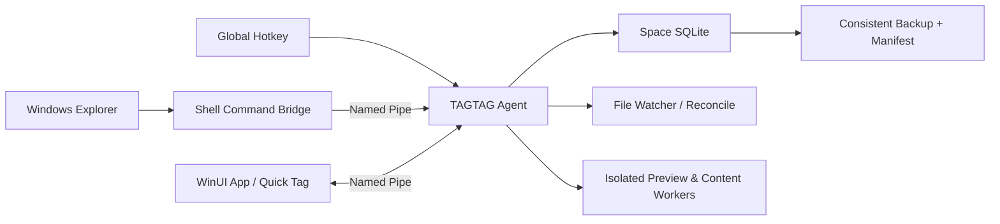

# TAGTAG 竞品调研与产品技术方案

> 调研日期：2026-08-07
> 竞品范围：tagLyst Next 4.752、localtags、TagSpaces、DeClutter
> DeClutter 暂按与需求最匹配的 `midnightdim/declutter` 分析；若用户指的是其他同名仓库，该列需要重新核对。

## 1. 结论先行

tagLyst Next 是四款产品中与目标最接近的产品参考：它已经把文件/文件夹标签、多标签、标签组、多级标签、继承、复杂筛选、多资料库、预览和后台快捷入口组合成完整工作流。但它不适合作为 TAGTAG 的底层模型直接照搬，主要原因是：标签名称承担了身份键、普通文件标签会改文件名、预设标签与文件名中的标签可能失去一致性、嵌套通过“标签与同名标签组”间接表达，且没有发现 Windows Explorer 右键直接打标签的证据。

其他三款产品各有值得借鉴的局部能力：

- TagSpaces：文件管理 UI、批量操作、标签库、AND/OR/NOT 检索、保存查询、插件式预览和活跃维护。
- DeClutter：自动化规则、dry-run、覆盖策略和按文件特征执行移动/复制/重命名的流程。
- localtags：完整性校验、历史版本和本地优先的归档思路。

TAGTAG 的正确产品方向不是“再做一个把 `#标签` 写进文件名的软件”，而是：

1. 以中央 SQLite 索引保存稳定身份和关系，普通标注不移动、不改名文件。
2. 用“标签实体 + 标签位置”表达同名、复用、多路径和近似无限层级。
3. 用后台 Agent 统一处理全局快捷键、Explorer 右键、索引和数据库写入。
4. 把物理移动做成显式、可预演、可撤销的整理功能，并先写持久操作日志。
5. 每个标签空间自包含、可一致性备份和迁移；实时多机协作另行设计。

## 2. 证据口径

能力矩阵使用以下标记：

| 标记 | 含义 |
|---|---|
| 已验证 | 官方文档、官方仓库或本机安装可以确认 |
| 部分 | 有相近能力，但语义或覆盖范围不足 |
| 未见 | 当前官方资料和本机检查未发现证据，不等于绝对不存在 |
| 冲突 | 产品模型明确与目标相反或无法表达该需求 |

## 3. 四款软件功能分析

### 3.1 tagLyst Next

**定位与优点**

- 本机安装版本为 4.752，是 Electron 桌面应用，可关闭主窗口后驻留后台。
- 文件和文件夹均可打多个标签；新版文件夹标签可存于资料库元数据并向后代继承。
- 支持标签分组、一个标签属于多个组、互斥组、颜色、图标、别名、同义词、正则和屏蔽型标签。
- 通过“标签 A + 同名子标签组 A”构造多级标签，文档称理论上可以任意多层，但不建议超过两层。
- 筛选支持 Exact、AND、OR、NOT 的主要语义，并能组合目录、类型、时间和关键字。
- 支持多个独立资料库、列表/卡片/瀑布流/阅读流/统计等视图、预览、星标和 `.tglnk` 引用。
- `Win+Ctrl+T` 可显示或隐藏主窗口；启用 `clipAgent` 后，`Ctrl+Alt+T` 可打开置顶快速窗口。

**关键限制**

- 普通文件标签写入文件名，例如 `合同.docx` 变成 `合同#已完成.docx`，会影响路径、外部链接和长路径限制。
- `tagDB` 以标签名称为键，不能同时保存两个独立同名 C。
- 预设标签改名或删除不会同步更新文件名中的既有标签，可能产生孤儿标签和语义漂移。
- 多级模型把标签实体与同名分组耦合，深层维护复杂。
- 本机常见 shell 注册位置未发现 tagLyst Explorer 右键项；软件内部右键不能等同于系统资源管理器右键。
- 官方建议单个资料库约 5,000 至 10,000 个文件，不能直接视为大规模索引方案。
- 旧 Electron 配置启用了 renderer 的 Node 集成并关闭上下文隔离，安全架构不应仿照。

**对 TAGTAG 的意义**

把 tagLyst 当作产品完整度和交互范围的主要参考，但重做标签身份、存储、层级、文件安全和进程安全模型。

### 3.2 TagSpaces

**定位与优点**

- 活跃维护的 Electron/TypeScript 离线文件管理器，同时有桌面、Web 和移动端形态。
- 同时支持文件与文件夹、多选批量加标签、拖放标签、标签颜色和标签库。
- 文件标签可写入文件名，或保存到同目录 `.ts` sidecar；文件夹标签保存在 `.ts/tsm.json`。
- 检索支持 AND、OR、NOT、自由文本、路径、类型、大小、日期、范围、历史和保存查询。
- 查看和编辑不同文件类型的扩展边界清楚，适合参考预览插件架构。

**关键限制**

- 标签库主要是“标签组 -> 标签”的单层组织，没有证据表明支持近似无限的多路径标签图。
- 文件名模式仍会改变路径；sidecar 模式在软件外移动/改名时容易与对象失配。
- 标签身份仍主要依赖名称和标签库上下文，不能完整表达同名独立实体。
- 官方说明单个 location 超过 100,000 个文件未优化。
- 开源代码为 AGPLv3，Pro 组件为专有许可；若 TAGTAG 不采用兼容许可，只能借鉴产品思路，不能无条件复制实现。

**对 TAGTAG 的意义**

重点借鉴文件管理 UI、查询表达力、保存查询和预览扩展；不采用文件名/同目录 sidecar 作为唯一真相。

### 3.3 localtags

**定位与优点**

- Go + SQLite + 本地网页 UI，本质上是带标签的本地备份和归档仓库。
- 支持文件备份、完整性校验、历史版本、标签组和本地 Markdown 图库。
- 要求每个文件至少两个标签，强调脱离目录树后的多维分类。

**关键限制**

- 产品明确放弃文件夹，文件夹不是统一的标注对象，与需求 1、5、10 冲突。
- 工作流是把文件放入指定导入目录并归档，不是对原位置进行无侵入索引。
- 没有发现全局快捷键、Explorer 右键、多级标签图或多标签空间证据。
- 最新活动停留在 2021 年，不宜作为现代 Windows 桌面应用基础。

**对 TAGTAG 的意义**

只借鉴完整性校验、历史版本和本地数据控制，不采用其“无文件夹归档仓库”产品模型。

### 3.4 DeClutter

**定位与优点**

- PySide6 + SQLite 的 Windows 优先桌面应用，支持文件/文件夹标签、预览、筛选和与 Explorer 拖放。
- 自动化规则可以按名称、大小、时间、标签和类型筛选，再执行移动、复制、删除、重命名或加标签。
- 规则设计包含 dry-run、覆盖策略、保留目录结构和忽略最新 N 个文件等防护选项。

**关键限制**

- 标签组是互斥组，不是可无限嵌套的标签层级。
- `.dc/<对象名>.json` sidecar 只保存标签名称数组，无法区分同名标签，也会随外部移动/改名失配。
- 损坏 sidecar 可能被直接删除，存在元数据丢失风险。
- SQLite 虽有整数 tag ID，但公开操作仍大量按名称进行；改名到已有名称会合并实体。
- 文件移动后的重定位依赖路径和 quick fingerprint，并限制扫描深度，不能替代完整的位置历史和事务日志。
- 对自动移动/删除这类高风险能力而言，现有显式回归测试很少。

**对 TAGTAG 的意义**

借鉴规则条件、dry-run 和覆盖策略，但重新实现标签身份、元数据可靠性、文件操作日志和恢复机制。

## 4. 对照用户 15 项需求

| # | 需求 | tagLyst Next | localtags | TagSpaces | DeClutter | TAGTAG 决策 |
|---:|---|---|---|---|---|---|
| 1 | 文件和文件夹统一打标签 | 已验证 | 冲突：放弃文件夹 | 已验证 | 已验证 | 统一 `resource`，用 `kind` 区分展示和操作能力 |
| 2 | 后台全局快捷键打标签 | 部分：有全局入口，当前选择直打仅部分验证 | 未见 | 未见 | 未见 | Agent 用 `RegisterHotKey`，快捷面板显示明确目标后提交 |
| 3 | Windows Explorer 右键打标签 | 未见传统 shell 注册 | 未见 | 未见直接打标签证据 | 未见 | 独立 `IExplorerCommand` 桥接进程，把选择项通过命名管道交给 Agent |
| 4 | 标签交叉、非唯一、同名可区分 | 部分：可跨组，名称仍是全局键 | 部分：名称标签 | 部分：组和颜色，身份仍偏名称 | 部分：有 ID，但名称操作会合并 | 名称不唯一；`tag_id`、`placement_id` 分离 |
| 5 | Explorer 式组织 UI | 已验证，多视图较完整 | 冲突：网页归档且无目录 | 已验证，较完整 | 部分：简易标签器 | 物理目录树、标签树、结果列表、属性检查器统一布局 |
| 6 | 一个对象有多个标签 | 已验证 | 已验证且至少两个 | 已验证 | 已验证 | `assignments` 多对多 |
| 7 | 同时标 A 与 A/B | 部分：多级模型可接近表达 | 未见层级 | 冲突：标签组单层 | 冲突：标签组单层 | 允许对象同时关联 A 位置和 A/B 位置；完全相同关联去重 |
| 8 | A/B/C 与 D/F/C；C 可相同或不同 | 部分：同一名称可跨组，不能保存独立同名 C | 未见 | 未见 | 冲突：同名会合并 | 同一 `tag_id` 可有多个位置；不同 `tag_id` 可同名 |
| 9 | 标签层级近似无上限 | 部分：理论任意，官方不建议超过两层 | 未见 | 未见 | 未见 | 递归模型、循环防护、懒加载；不设人为两层限制 |
| 10 | 文件浏览与标签层级关联 | 已验证 | 部分：标签浏览但无层级目录 | 部分：单层组筛选 | 部分：标签筛选 | 标签面包屑、路径匹配、概念匹配、是否含后代四种明确状态 |
| 11 | 标签新增、修改、删除 | 已验证 | 已验证 | 已验证 | 已验证 | CRUD + 合并、复用、独立同名、删除影响预览和软删除 |
| 12 | 清标签后恢复原位置 | 部分：普通挂载不移动；导入移动无完整撤销证据 | 冲突：导入归档仓库 | 部分：普通标注不负责移动恢复 | 未见规则移动的通用撤销 | 普通标注从不移动；显式物理整理有位置历史、日志和恢复命令 |
| 13 | 检索机制 | 已验证，表达力强 | 部分：标签检索 | 已验证，表达力强 | 部分：标签和规则过滤 | ID 化查询 AST + FTS + AND/OR/NOT + 保存查询 |
| 14 | 最近、常用标签 | 已验证部分相关能力 | 未见 | 部分：搜索历史等 | 部分：最近目录 | 统一使用事件流计算最近对象、最近标签和衰减频率 |
| 15 | 多标签空间、备份、迁移 | 已验证多资料库及整库复制；完整备份能力有限 | 部分：本地仓库 | 部分：多 location、标签库导入导出 | 未见独立空间 | 每空间独立 DB/manifest；一致性快照、校验、导入和路径重映射 |

综合判断：tagLyst Next 最适合作为功能范围基准，TagSpaces 最适合作为查询与文件管理交互参考，DeClutter 最适合作为自动整理规则参考，localtags 只适合参考数据完整性与历史版本。

## 5. TAGTAG 的无冲突标签语义

### 5.1 四个必须分开的概念

| 概念 | 例子 | 稳定身份 | 说明 |
|---|---|---|---|
| 标签实体 `tag` | 名称为 C、绿色 | `tag_id` | 名称、颜色、图标可改；名称不唯一 |
| 标签位置 `placement` | A/B/C 下的 C | `placement_id` | 表示一个实体出现在层级中的具体位置 |
| 直接标注 `assignment` | 文件直接标到 A/B/C | `assignment_id` | 关联对象和位置，保留路径上下文 |
| 有效标注 `effective tag` | 因后代命中或文件夹继承而可见 | 查询结果 | 不伪装成直接标注，不作为重复行持久化 |

推荐的层级不是单纯的 `tags.parent_id`。`tag_placements` 形成一棵或多棵位置树，一个 `tag_id` 可以被多个位置引用；把位置投影回实体后，整体等价于多父有向无环图。



这里 P1 和 P2 是“同一个 C 的两个位置”，P3 是“另一个同名 C”。UI 不能只显示 `C`，至少要显示颜色、面包屑和“复用实体”标记，例如：

- `C · A/B`，绿色，链环标记，表示 `tag_c1`。
- `C · D/F`，绿色，链环标记，仍是 `tag_c1`。
- `C · D/F`，红色，无共享标记，表示独立的 `tag_c2`。

### 5.2 “重复标签”的明确规则

1. 同一对象、同一 `placement_id` 的完全相同标注只保存一次，因为重复两次没有额外语义。
2. 同一对象可以同时直接标注 A 和 A/B，它们是两个不同位置，分别保存。
3. 同一对象可以同时标注 A/B/C 和 D/F/C，即使两个位置引用同一个 `tag_id`，路径语义仍不同。
4. 查询时提供两种模式：按“此位置”匹配，或按“同一标签实体的全部位置”匹配。
5. 父标签命中默认是查询展开，不自动制造隐藏的父级直接标注。

### 5.3 层级约束

- 产品语义近似无层数上限；数据库使用递归查询，UI 按需展开和分页。
- 禁止位置成为自己的祖先，保存前必须检测循环。
- 默认禁止同一 `tag_id` 在同一祖先链中再次出现，避免 `A/B/A` 造成语义递归；高级模式如需开放必须明确提示。
- 同一父位置下，允许多个同名但不同 `tag_id` 的标签；UI 创建时要求用户选择“复用已有标签”或“创建独立同名标签”。
- 标签改名只修改 `tag_id` 对应实体，不改变位置和标注关系。
- 删除前展示受影响位置、直接标注数、保存查询和规则；默认软删除，可恢复。

### 5.4 直接标签与继承标签

文件夹标签向下继承必须是每个标注可配置的策略，而不是全局隐藏行为：

- `none`：只标文件夹自身。
- `children`：只对直接子项有效。
- `descendants`：对全部后代有效。

对象属性面板分别显示“直接标签”和“继承标签”，继承标签注明来源文件夹。清除标签默认只清直接标签；若用户要消除继承效果，应导航到来源文件夹修改策略，不能在子文件上制造难以解释的静默例外。后续若需要例外，可显式增加 `inheritance_block`，而不是负数标注。

## 6. 文件浏览与界面结构

### 6.1 主界面

采用安静、密集、适合反复操作的 Explorer 式布局：

- 左侧导航：标签空间、物理位置、标签层级、保存查询、最近、收藏。
- 顶部命令栏：后退、前进、上一级、面包屑、搜索框、视图和排序。
- 中央列表：名称、直接/继承标签、路径、类型、大小、修改时间；支持虚拟滚动和列配置。
- 右侧检查器：预览、直接标签、继承来源、全部物理位置、操作历史。
- 底部操作抽屉：索引、备份、迁移、物理整理和失败重试。

“物理浏览”和“标签浏览”是两种视图，不是两套文件：

- 物理视图面包屑：`空间 / 位置 / Projects / Alpha`。
- 标签视图面包屑：`空间 / 标签 / A / B / C`。
- 组合视图：标签路径和搜索条件以查询 chip 表示，可继续添加 AND/OR/NOT 条件。

选择标签位置时提供“只看直接命中”和“包含后代”开关。选择同名 C 时，搜索 chip 内部保存 `placement_id` 或 `tag_id`，绝不只保存显示文字。

### 6.2 高频打标签流程

**应用内**

1. 选择一个或多个文件/文件夹。
2. 按快捷键或点标签按钮打开同一个 Quick Tag 面板。
3. 搜索最近/常用标签，结果显示完整路径和颜色。
4. 按 Enter 应用，面板保留撤销入口。

**全局快捷键**

1. 后台 Agent 收到 `RegisterHotKey` 消息。
2. 在窗口失焦前尽力读取前台 Explorer 选择；若失败则读取剪贴板路径或要求拖入目标。
3. Quick Tag 面板必须列出将被修改的对象，不允许在目标不明确时静默打标签。
4. 面板向 Agent 提交结构化的资源 ID/路径和 `placement_id`。

**Windows Explorer 右键**

- 第一版只提供稳定命令“使用 TAGTAG 添加标签”，打开 Quick Tag 面板。
- Shell 组件接收精确的多选 `IShellItem`，通过按当前用户 SID 限制的命名管道交给 Agent。
- Shell 组件不打开 SQLite、不加载完整 UI、不执行文件移动，避免拖慢或拖垮 Explorer。
- 后续可增加“最近标签”子菜单，但数据来自只读小缓存，并设置严格超时。

## 7. 推荐数据模型

每个空间使用独立目录，例如：

```text
MySpace.tagspace/
  space.json
  index.sqlite3
  backups/
  exports/
```

SQLite 是在线真相来源；便携 sidecar 只作为显式导出/导入格式，不与数据库长期双写，避免分裂真相。

| 表 | 关键字段 | 作用 |
|---|---|---|
| `spaces` | `space_id`, `name`, `schema_version` | 空间身份和版本 |
| `roots` | `root_id`, `uri`, `kind`, `is_online` | 本地卷、可移动盘或 UNC 根目录 |
| `resources` | `resource_id`, `kind`, `created_at`, `deleted_at` | 文件/文件夹统一逻辑对象 |
| `resource_locations` | `location_id`, `resource_id`, `path`, `file_identity`, `valid_from`, `valid_to`, `is_original` | 当前路径与不可覆盖的位置历史 |
| `tags` | `tag_id`, `name`, `color`, `icon`, `description`, `deleted_at` | 名称不唯一的标签实体 |
| `tag_aliases` | `tag_id`, `alias`, `match_kind` | 同义词和可选匹配规则 |
| `tag_placements` | `placement_id`, `tag_id`, `parent_placement_id`, `sort_order` | 标签在层级中的具体位置 |
| `assignments` | `assignment_id`, `resource_id`, `placement_id`, `inherit_mode`, `source`, `created_at` | 直接标注；唯一约束为资源 + 位置 |
| `saved_queries` | `query_id`, `name`, `query_ast_json` | 保存 ID 化查询 AST，而非名称字符串 |
| `usage_events` | `event_id`, `resource_id`, `placement_id`, `event_type`, `occurred_at` | 最近和常用统计的原始事件 |
| `operation_batches` | `batch_id`, `type`, `state`, `created_at` | 一次批量物理操作的状态机 |
| `operation_items` | `item_id`, `batch_id`, `resource_id`, `from_uri`, `to_uri`, `precondition_json`, `state`, `error` | 可恢复的逐项移动/重命名日志 |
| `backup_runs` | `backup_id`, `manifest_hash`, `state`, `created_at` | 备份、校验和恢复审计 |
| `content_fts` | FTS 虚拟表 | 文件名、路径、描述和可选正文索引 |

重要约束：

- `tags.name` 只建普通索引，不建唯一索引。
- `tag_placements(parent_placement_id, tag_id)` 可防止同一实体在同一父位置下无意义重复；同名不同实体不受影响。
- `assignments(resource_id, placement_id)` 唯一，避免完全相同的重复标注。
- `resource_id` 是空间内逻辑 ID。Windows File ID、卷序列号、大小、时间和 quick hash 只作为重定位证据，不直接作为永恒主键，避免硬链接和复制件被错误合并。
- 所有外键启用，删除采用软删除和显式清理任务；每次迁移都有 schema version 和回滚前备份。

## 8. 检索、最近和常用

查询编辑器内部保存结构化 AST：

```text
AND(
  TAG_PLACEMENT(A/B/C, include_descendants=false),
  NOT(TAG_CONCEPT(已归档, all_placements=true)),
  PATH_UNDER(D:/Projects),
  MODIFIED_AFTER(2026-01-01)
)
```

支持以下维度：

- 标签位置、标签实体、直接/有效标签、是否包含后代。
- AND、OR、NOT 和括号。
- 名称、扩展名、路径、大小、创建/修改时间、文件/文件夹类型。
- 可选正文索引和预览元数据。
- 当前目录、当前根、当前空间和跨空间范围；跨空间查询只读聚合，各空间仍独立写入。

“最近”不能只等同于文件系统修改时间。至少区分最近查看、最近打标签、最近导入和最近使用标签。“常用标签”从 `usage_events` 计算带时间衰减的使用频率，并允许用户固定、隐藏或清空历史。系统状态如星标、离线、索引失败不要伪装成普通标签，应作为独立筛选属性。

## 9. Windows 技术架构

### 9.1 推荐选型

- UI：C# / .NET 8 + WinUI 3，采用 MVVM 和虚拟化列表，贴近 Windows Fluent 视觉与无障碍能力。
- Agent：.NET 后台常驻进程，拥有空间数据库写入权、热键、托盘、文件监控和任务队列。
- 数据库：`Microsoft.Data.Sqlite` + WAL；同一空间由 Agent 串行化写事务，UI 不直接写 DB。
- Shell：最小化的 C++/WinRT `IExplorerCommand` 组件或等价的进程外命令桥；安装和卸载必须完整注册/注销。
- IPC：当前用户专用命名管道，消息带版本、请求 ID、空间 ID 和明确动作，不暴露本地 HTTP 服务。
- 索引：元数据索引在 Agent；PDF/Office/媒体提取放到受限 Worker，单文件超时和崩溃不能影响 Agent。

若团队更擅长 Web 前端，可把 UI 替换为 Tauri 2 + React，但 Windows Shell 组件、Agent 单写者和操作日志仍不能省略。Windows 深度集成优先时，建议先采用 .NET 路线。



### 9.2 文件监控与身份重定位

- `FileSystemWatcher`/`ReadDirectoryChangesW` 只负责快速发现变化，不能作为唯一事实来源；缓冲区溢出或离线恢复后必须做增量/全量对账。
- 支持本地卷、可移动盘和 UNC 的 online/offline/read-only 状态。
- 外部改名或移动优先用卷内 File ID 匹配，再用大小、时间和 quick hash 辅助；存在多个候选时必须要求用户确认。
- 不自动跨根目录扫描整机寻找丢失文件；扫描范围由空间根和用户授权决定。
- 路径统一规范化用于比较，但保留原始大小写用于显示；覆盖长路径、保留名、重解析点和权限错误测试。

### 9.3 安全边界

- Shell 组件不加载插件、不解析文档、不直接访问 DB。
- 命名管道 ACL 限制到当前用户，所有 IPC 操作做 schema 验证和路径规范化。
- 预览和正文提取视为处理不可信文件，采用进程隔离、资源限制和超时。
- 插件仅通过版本化能力接口工作，默认没有任意文件写权限。
- 安装包签名，Explorer 扩展注册可回滚，卸载不能遗留无效右键项。

## 10. 文件移动、清标签与恢复

### 10.1 默认规则

普通“添加、修改、清除标签”只修改数据库关系：

- 不重命名文件。
- 不移动文件。
- 不在每个目录写隐藏 sidecar。
- 清除全部直接标签后，文件自然仍在原位置，需求 12 在常规流程中不会演变成恢复问题。

### 10.2 显式物理整理

只有用户主动执行“按标签整理到文件夹”时才移动实体文件：

1. 生成 dry-run，展示来源、目标、冲突和跨卷复制成本。
2. 在 SQLite 事务中写入 `operation_batches/items`，状态为 `prepared`，持久化 `from_uri`、`to_uri`、文件身份和前置条件。
3. 提交日志后执行文件系统操作。
4. 验证目标对象身份，追加 `resource_locations` 历史，再把 item 标为 `applied`。
5. 崩溃恢复时对 `prepared` 项核对来源和目标，决定继续、回滚或要求人工确认。
6. 撤销时先检查原路径冲突；默认不覆盖现有文件，提供跳过、改名恢复或选择新位置。

“清除标签并恢复原位置”应作为组合命令：只回滚由 TAGTAG 日志记录且尚可安全撤销的物理整理，再清除直接标签。外部程序完成的移动不能假装可无条件恢复。

删除文件默认送入回收站；永久删除、覆盖和批量移动都需要独立确认，不能与普通打标签共享快捷提交动作。

## 11. 标签空间、备份和迁移

### 11.1 空间语义

- 每个空间有独立 `space_id`、DB、标签实体、标签位置、保存查询和使用历史。
- 同一物理目录不建议同时被两个可写空间管理；若允许，UI 必须明确显示当前空间，标签互不自动合并。
- 跨空间复用标签通过“导入/链接模板”显式完成，不共享可变数据库行。
- 应用保持单 Agent，多空间在同一进程内切换，避免多个实例争用数据库和全局快捷键。

### 11.2 备份

- Agent 使用 SQLite Online Backup API 或等价一致性快照，不直接复制一个正在 WAL 写入的 DB 文件。
- 备份包含 `space.json`、数据库快照、schema version、根路径映射、可选导出文件和 SHA-256 manifest。
- 完成后执行可打开、`PRAGMA integrity_check`、行数摘要和 manifest 校验。
- 保留轮换策略和最后成功状态；`.bak` 只能作为局部保护，不能替代完整备份。

### 11.3 迁移

1. 校验备份和 schema 版本。
2. 以只读方式预览空间名、对象数、标签数、原根路径和缺失根。
3. 用户为变化的盘符/UNC 路径建立重映射。
4. 导入到临时空间并执行完整性检查。
5. 原子切换为正式空间；失败时保留原空间和诊断报告。

备份/迁移与实时多机协作必须分开。第一阶段不要让多台机器直接同步一个正在写入的 SQLite 文件；真正协作需要单写者服务或操作日志、冲突和权限协议。

## 12. 分阶段实现路线

### 阶段 A：语义原型

- 实现标签实体、标签位置、同名独立/复用、循环检测和直接/有效标签计算。
- 用小型 UI 原型验证 A、A/B、两条路径同一 C、两条路径不同 C 的创建、显示、查询和删除。
- 在此阶段冻结术语和交互，避免数据库完成后再改变“同一个标签”的含义。

### 阶段 B：核心 MVP

- 空间、根目录、文件/文件夹统一索引。
- Explorer 式物理视图和标签视图。
- 多选打标签、标签 CRUD、层级、搜索、最近和常用。
- 普通标注完全不修改文件名和位置。
- 备份/恢复最小闭环。

### 阶段 C：Windows 集成

- 后台 Agent、托盘和单实例。
- 全局快捷键 Quick Tag。
- Explorer 多选右键命令及安装/卸载。
- 文件监控溢出恢复、离线根、外部移动重定位。

### 阶段 D：可靠物理整理

- dry-run、批量操作日志、移动/重命名、撤销和崩溃恢复。
- 路径冲突、跨卷、权限、长路径、UNC 和可移动盘测试。
- 清标签并恢复原位置的组合流程。

### 阶段 E：高级能力

- 正文索引、预览 Worker、保存查询和规则引擎。
- 可选互斥约束、智能标签建议和标签模板。
- 经过独立协议设计后再考虑多机协作。

不要在 MVP 同时实现规则自动移动、全文提取、插件系统和实时协作。它们都会扩大文件安全和一致性风险，但不影响先验证最关键的标签模型。

## 13. 验收与测试重点

**功能验收**

1. 同一个批次可以混选文件和文件夹并标注。
2. 应用隐藏后，全局快捷键能打开 Quick Tag，且目标列表准确、可取消。
3. Explorer 对单选、多选、文件夹、长路径和 UNC 项都能调用右键命令。
4. 两个同名 C 可独立改色、改名和删除；复用的同一个 C 在两条路径保持同一实体身份。
5. A、A/B、A/B/C、D/F/C 的直接与有效匹配结果符合查询模式。
6. 层级深度测试至少覆盖 100 层，UI 不一次性展开整棵树，循环输入被拒绝。
7. 清除普通标签不产生任何文件系统改名或移动。
8. 物理移动在进程崩溃、磁盘断开和目标冲突后可对账，不能静默丢文件。
9. 备份在新机器和新盘符下可校验、重映射并恢复。

**规模与可靠性目标**

- 分别建立 10 万和 100 万资源的基准库，测试首次索引、增量索引、标签递归、组合检索、最近列表和备份。
- 中央列表全程虚拟化和分页；任何标签树节点展开都不能触发全库对象加载。
- 对层级与文件操作状态机做属性测试；对每次 schema migration 做旧版备份恢复测试。
- 对文件监控缓冲溢出、Agent 强制退出、SQLite WAL 恢复、只读根和权限变化做故障注入。
- Shell 组件设置严格响应时间，Agent 不在线时快速拉起或给出可理解错误，不能阻塞 Explorer。

## 14. 最终建议

第一优先级不是把 tagLyst 的所有界面重做一遍，而是先证明两个基础不会出错：

1. “标签实体 + 标签位置 + 直接/有效标注”能覆盖同名、复用、多路径和层级查询。
2. “数据库标注不动文件 + 显式物理操作日志”能覆盖清标签、恢复原位置和异常恢复。

这两个基础一旦稳定，tagLyst 的多视图、TagSpaces 的复杂检索、DeClutter 的规则和 localtags 的校验能力都可以逐步叠加；如果基础仍以标签名和文件名为身份，功能越完整，后续改名、迁移、同名标签和故障恢复反而越难修复。

## 15. 主要来源

- [tagLyst Next 上手指南](https://www.yuque.com/taglyst/tgln-docs)
- [tagLyst 文件标签维护](https://www.yuque.com/taglyst/tgln-docs/tags)
- [tagLyst 文件筛选检索](https://www.yuque.com/taglyst/tgln-docs/filter)
- [tagLyst 资料库管理](https://www.yuque.com/taglyst/tgln-docs/file-box)
- [tagLyst 同步与协作](https://www.yuque.com/taglyst/tgln-docs/sync)
- [tagLyst 文件基本操作](https://www.yuque.com/taglyst/tgln-docs/file-ops)
- [tagLyst FAQ](https://www.yuque.com/taglyst/tgln-docs/faq)
- [localtags 官方仓库](https://github.com/ahui2016/localtags)
- [TagSpaces 官方仓库](https://github.com/tagspaces/tagspaces)
- [TagSpaces 标签文档](https://docs.tagspaces.org/tagging/)
- [TagSpaces 标签库文档](https://docs.tagspaces.org/ui/taglibrary/)
- [TagSpaces 搜索文档](https://docs.tagspaces.org/search/)
- [DeClutter 暂定官方仓库](https://github.com/midnightdim/declutter)
